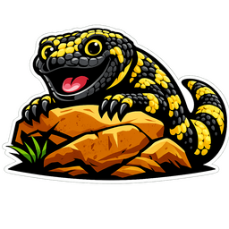

<p align="center">
  
</p>

# gilamonster-agent

**The Gilamonster agent matrix.** It *inherits* [newt-agent](https://github.com/Gilamonster-Foundation/newt-agent)'s
airframe — the lean chat + agentic-coding TUI, the object-capability identity
(signed, attenuation-only `AgentKey` caveats), the ACP worker, and the coder —
from the published `newt-*` crates, and *extends* it into a Hermes/Thoon-style
multi-agent matrix.

> newt is the cell; gilamonster-agent is the organism. The extension point is a
> **separate binary**, not a plugin slot — which is why newt stays *opinionated,
> not extensible*.

## Status: v0.1 scaffold (build gated on newt-agent v0.6.5)

This is the v0.1 structure. It **builds once newt-agent v0.6.5 publishes its
crates to crates.io** — currently **deferred** (the release is waiting on the
local + enterprise/NVIDIA inference rework; the publish also has two open bugs:
newt-agent#120, newt-agent#121). Until then `cargo build` will report
`no matching package newt-tui 0.6.5`.

The shape, once buildable:

```bash
gila code            # the inherited newt chat + agentic-coding TUI (the airframe)
gila matrix          # the extension layer — surfaces the inherited ocap identity (stub)
```

`gila code` hands off to `newt_tui::run_code`; `gila matrix` is where the
multi-agent layer lands.

## What's inherited (published `newt-*` crates, v0.6.5)

- `newt-tui` — the chat + agentic-coding TUI (and, transitively, `newt-core`,
  `newt-coder`, `newt-inference`, `newt-tools`).
- `newt-identity` — the per-user `UserKey` → session `AgentKey` → attenuated
  operating-key chain. The whole matrix runs under one capability model.

## What gets extended (the matrix — not yet built)

- Many newt airframes composed over the **agent-mesh** airspace.
- **drake** lifecycle + orchestration.
- The rich settings / dashboard surfaces (ported from newt's git history, where
  the settings TUI was deliberately removed to keep newt lean).

## The split, recorded

newt-agent is deliberately scoped to chat + agentic coding (Codex/Claude-Code
spirit, lean). **Additional features go here.** See `newt-agent#89`.

## Contributing

This project follows the Gilamonster
[Centaur Developer](https://github.com/Gilamonster-Foundation/agents) style:
human/agent teams contributing as a single unit, with a human always in the
loop and agent contributions credited in the git record.

- Rules template: [`rules/AGENTS.md`](https://github.com/Gilamonster-Foundation/agents/blob/main/rules/AGENTS.md)
- Skills: [`rust-tdd`](https://github.com/Gilamonster-Foundation/agents/blob/main/skills/rust-tdd/SKILL.md),
  [`pyo3-wrapping`](https://github.com/Gilamonster-Foundation/agents/blob/main/skills/pyo3-wrapping/SKILL.md)

## Logos

Meet **Gilly**, the Gilamonster mascot — mirrored here from the
[agents](https://github.com/Gilamonster-Foundation/agents) repository at
standard sizes under `docs/logos/` (`gilly-16.png` … `gilly-512.png`).

## License

Apache-2.0.
